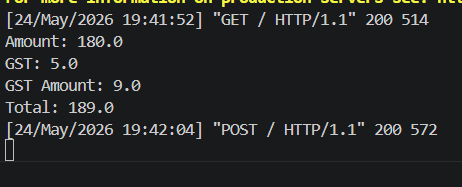
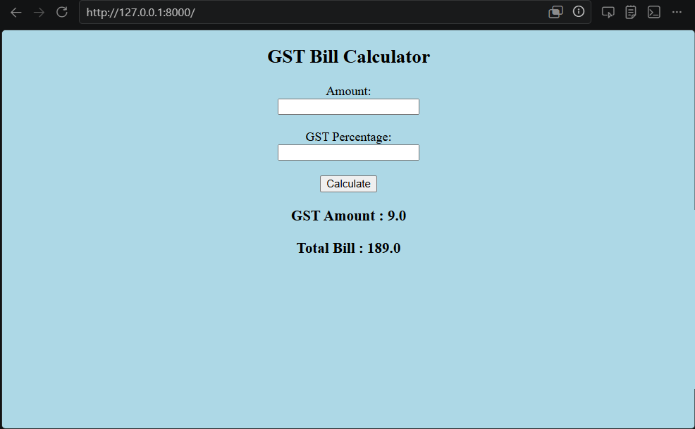

# Ex.04 Design a Website for Server Side Processing
## Date:24-05-2026

## AIM:
To create a web page to calculate total bill amount with GST from price and GST percentage using server-side scripts.

## FORMULA:
Bill = P + (P * GST / 100)
<br> P --> Price (in Rupees)
<br> GST --> GST (in Percentage)
<br> Bill --> Total Bill Amount (in Rupees)

## DESIGN STEPS:

### Step 1:
Clone the repository from GitHub.

### Step 2:
Create Django Admin project.

### Step 3:
Create a New App under the Django Admin project.

### Step 4:
Create a HTML file to implement form based input and output.

### Step 5:
Create python programs for views and urls to perform server side processing.

### Step 6:
Receive input values from the form using request.POST.get().

### Step 7:
Calculate the total bill amount (including GST).

### Step 8:
Display the calculated result in the server console.

### Step 9:
Render the result to the HTML template.

### Step 10:
Publish the website in Localhost.

## PROGRAM:

MATH.HTML:
```

<!DOCTYPE html>
<html>
<head>
    <title>GST Calculator</title>
</head>

<body bgcolor="lightblue">

<center>

<h2>GST Bill Calculator</h2>

<form method="POST">



<label>Amount:</label><br>

<input type="text" name="amount"><br><br>

<label>GST Percentage:</label><br>

<input type="text" name="gst"><br><br>

<button type="submit">
Calculate
</button>

</form>



<h3>GST Amount : {{ tax }}</h3>

<h3>Total Bill : {{ total }}</h3>



</center>

</body>
</html>

```

views.py:

```

from django.shortcuts import render

def calculate_gst(request):

    tax = None
    total = None

    if request.method == "POST":

        amount = float(request.POST.get("amount"))
        gst = float(request.POST.get("gst"))

        tax = (amount * gst) / 100

        total = amount + tax

        print("Amount:", amount)
        print("GST:", gst)
        print("GST Amount:", tax)
        print("Total:", total)

    return render(
        request,
        "mathapp/math.html",
        {
            "tax": tax,
            "total": total
        }
    )

```

urls.py:

```

from django.contrib import admin
from django.urls import path
from mathapp import views

urlpatterns = [

    path(
        'admin/',
        admin.site.urls
    ),

    path(
        '',
        views.calculate_gst,
        name='calculate_gst'
    ),

]

```

## OUTPUT - SERVER SIDE:



## OUTPUT - WEBPAGE:



## RESULT:
The a web page to calculate total bill amount with GST from price and GST percentage using server-side scripts is created successfully.
